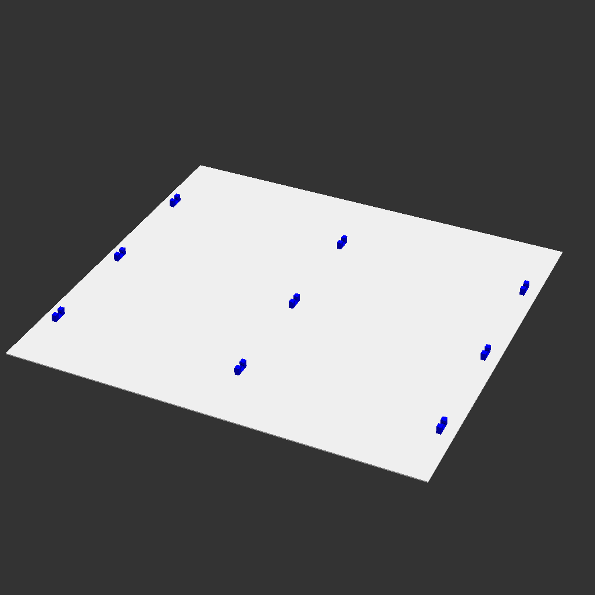

# OpenSCAD Files

This is a collection of random things that I've modelled in [OpenSCAD]
for personal use.

[OpenSCAD]: https://openscad.org/

## Development

OpenSCAD may be opened in a window with automatic updates using

```sh
openscad --viewall <file.scad>
```

## Rendering

```sh
openscad <file.scad> -o <file.stl>
```

## Contents

> [!NOTE]
>
> This sections is auto generated (ish) and may not be 100% perfect.

# `lamy-t10.scad`

Clip for holding five LAMY T10 ink cartridges (https://www.lamy.com/en-us/p/lamy-t-10-ink/50727869088078)


# `wire-rack-surface.scad`



