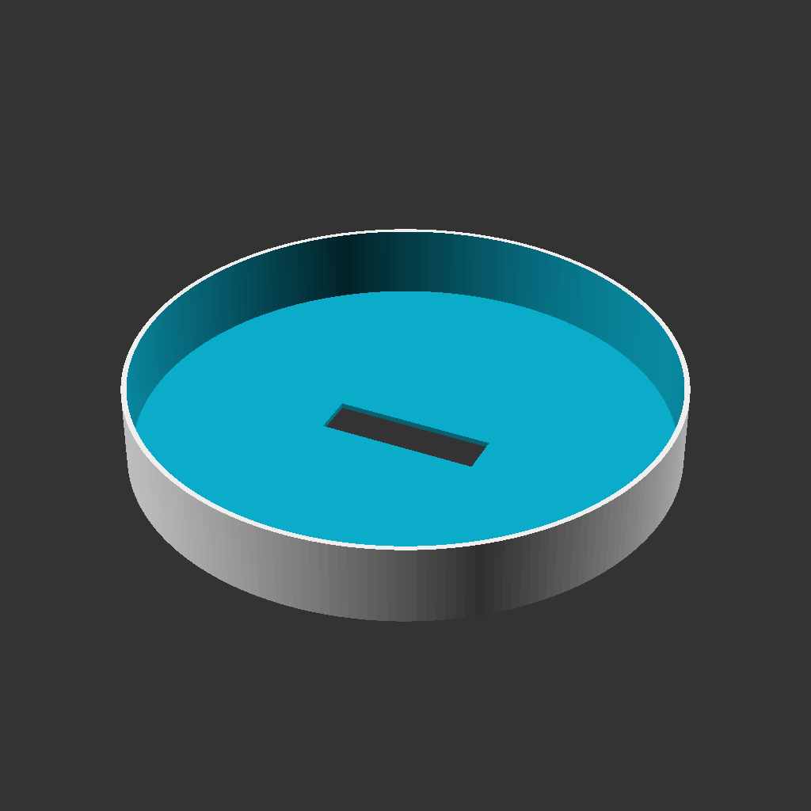
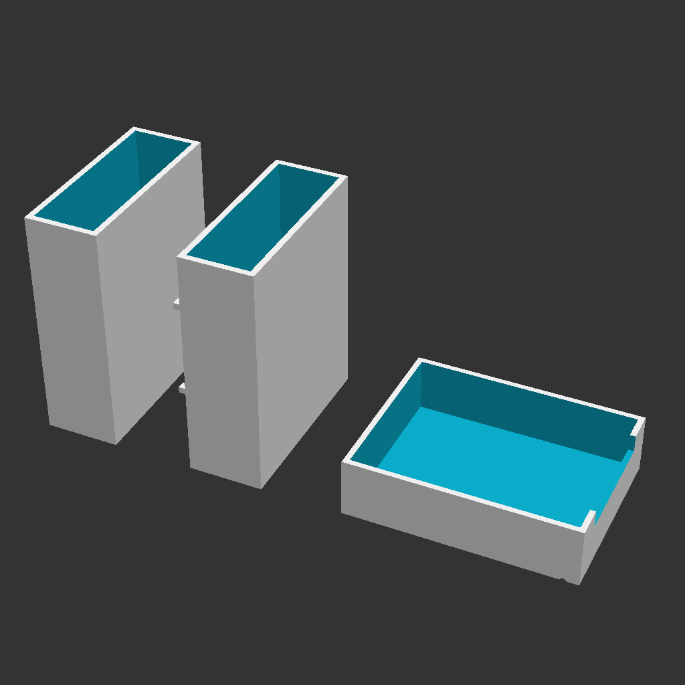
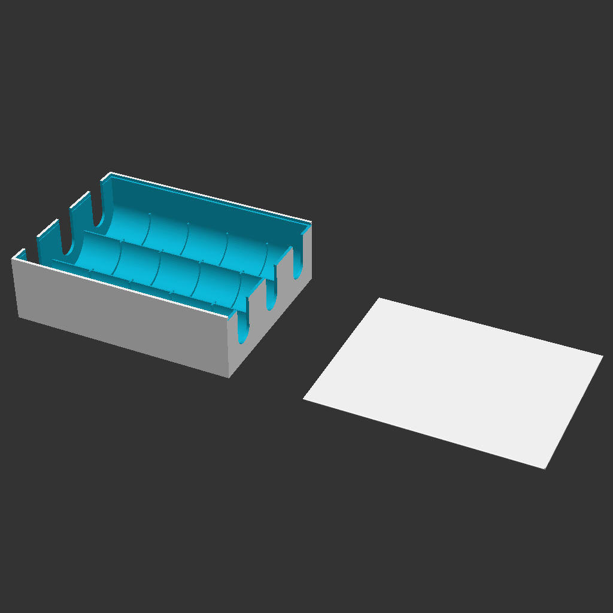
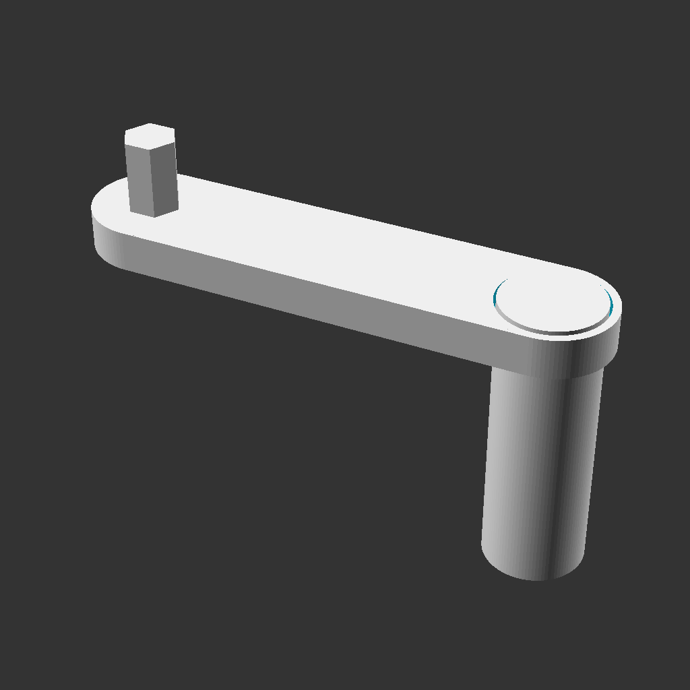
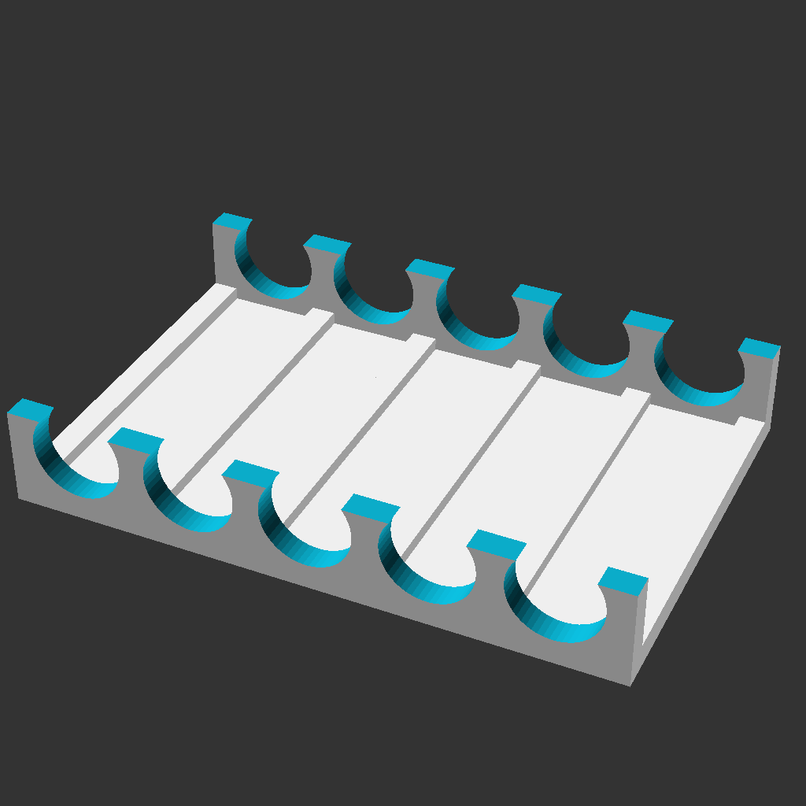
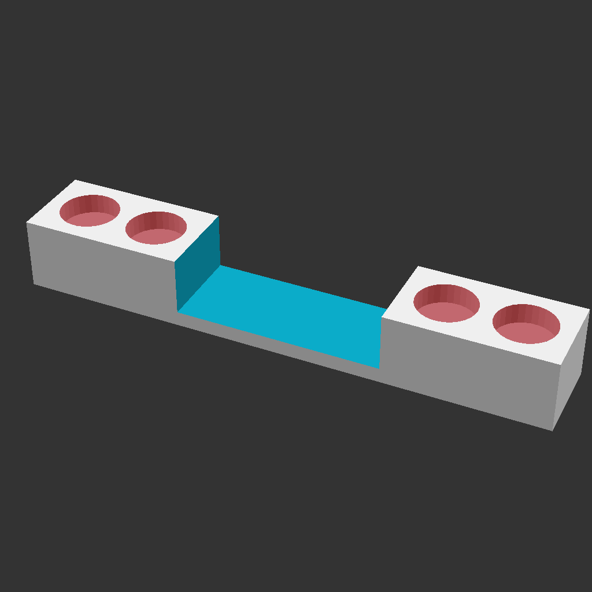
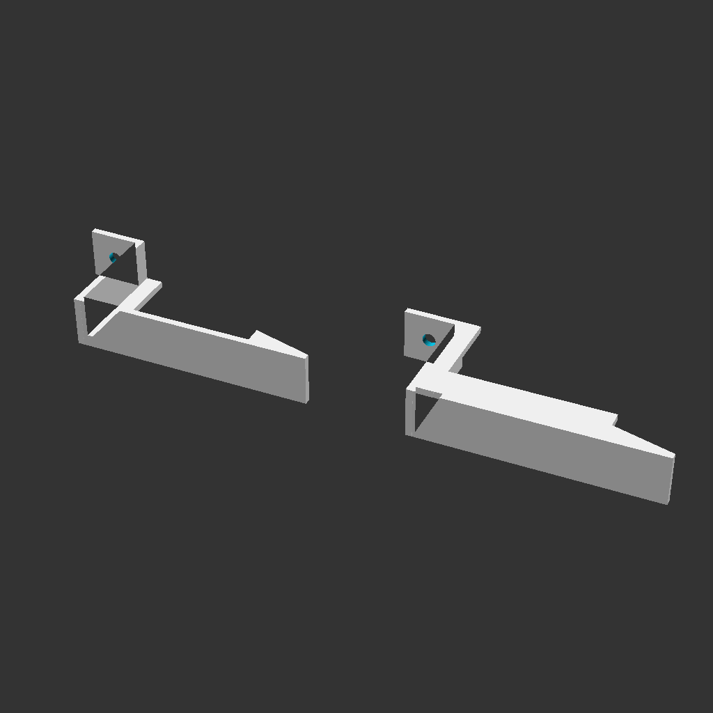
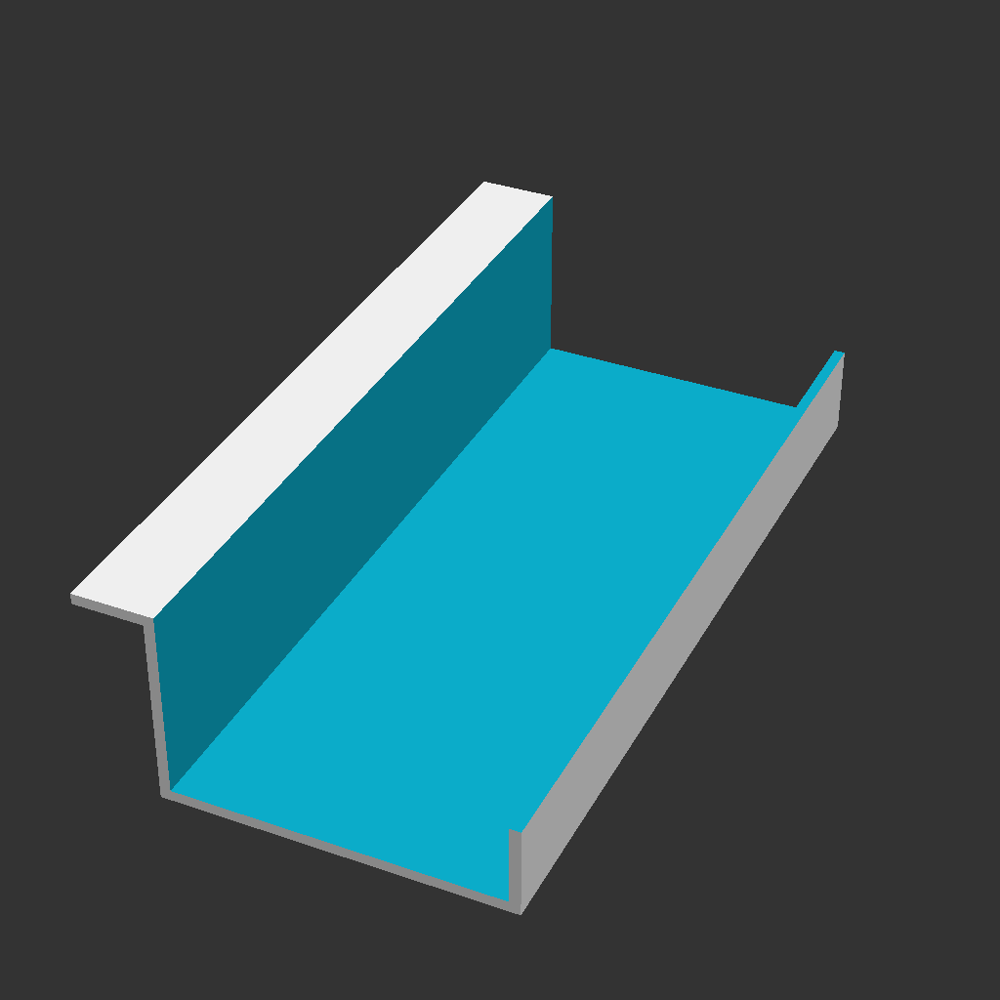
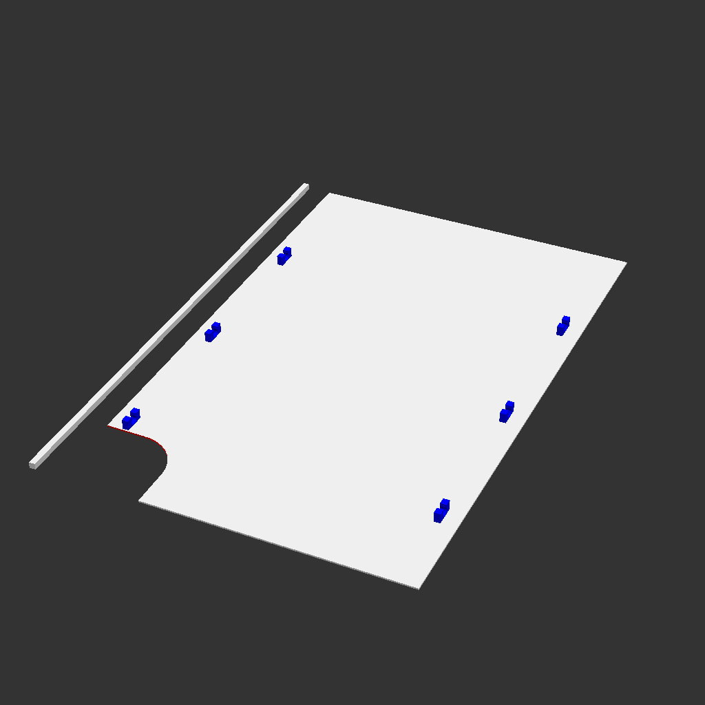
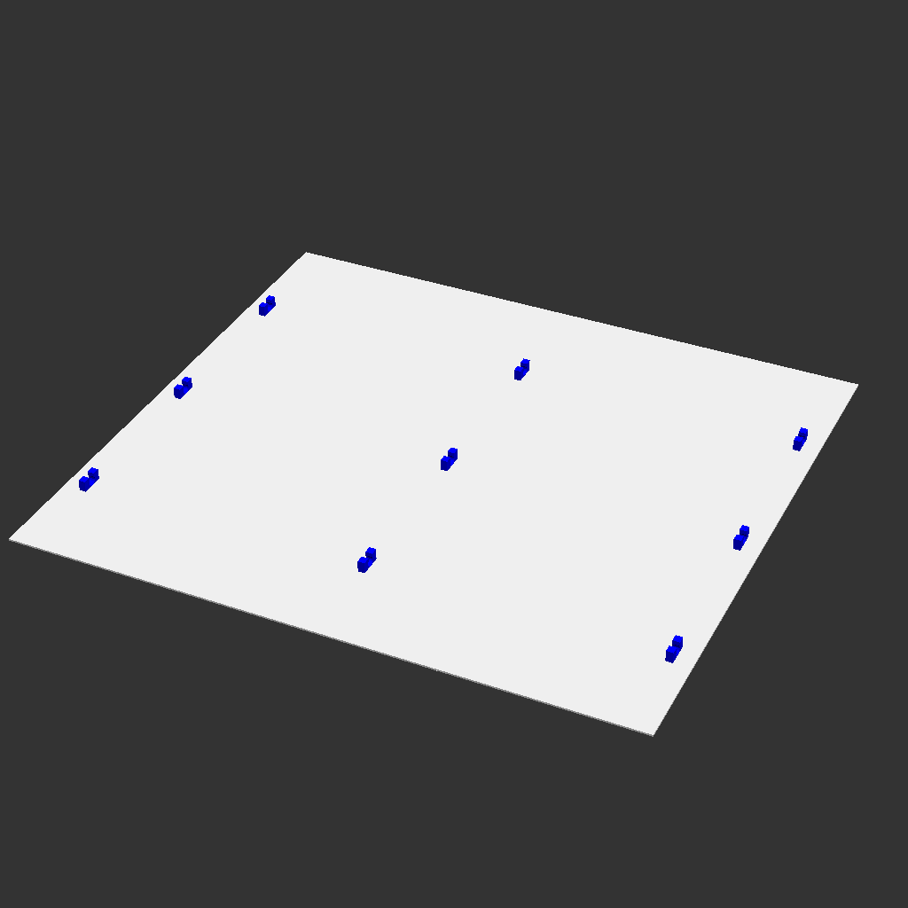

# OpenSCAD Files

This is a collection of random things that I've modelled in [OpenSCAD]
for personal use.

[OpenSCAD]: https://openscad.org/

## Development

OpenSCAD may be opened in a window with automatic updates using

```sh
openscad --viewall <file.scad>
```

## Rendering

```sh
openscad <file.scad> -o <file.stl>
```

## Contents

> [!NOTE]
>
> This sections is auto generated (ish) and may not be 100% perfect.

# `can-top.scad`

A simple lid for a can that I have, with a slot for aluminium can tabs



# `cartridge-box.scad`

A small box designed hold some ink cartridges



# `chip-box.scad`

A box for holding poker chips



# `crank.scad`

Crank for https://www.thingiverse.com/thing:264769



# `lamy-t10.scad`

Clip for holding five LAMY T10 ink cartridges (https://www.lamy.com/en-us/p/lamy-t-10-ink/50727869088078)



# `magnet-cable.scad`

A thing that can be connected to a cable to make it magnetic



# `power-brick-clip.scad`

A pair of clips for holding a power brick



# `power-brick-holder.scad`

Holder for laptop charger power brick



# `wire-rack-surface-corner.scad`

Surface for the corner of a wire rack



# `wire-rack-surface.scad`

Surface for a wire rack



